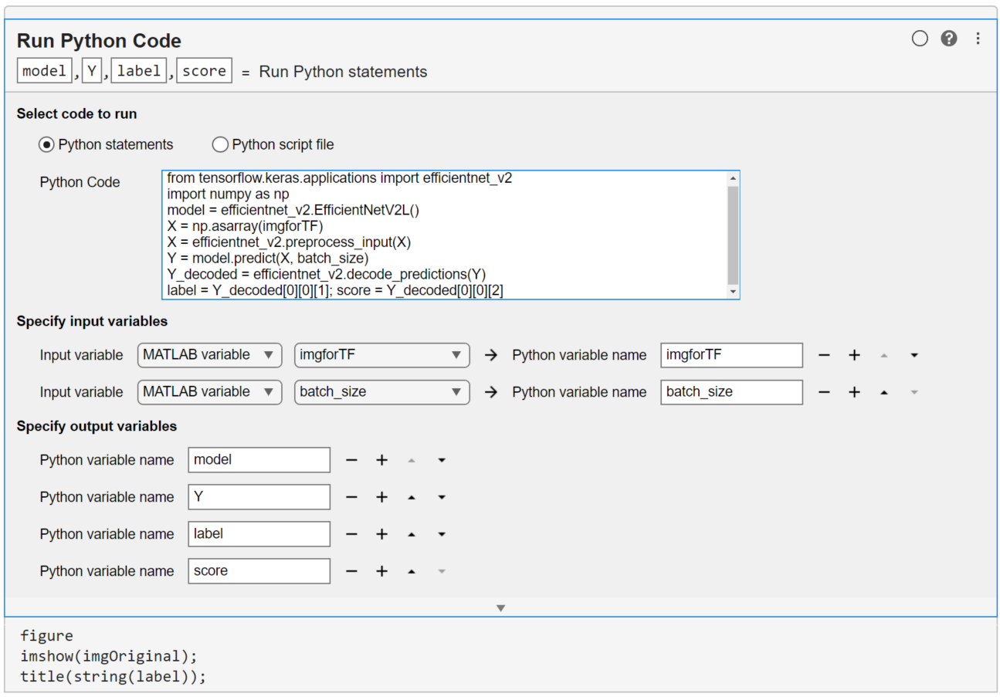
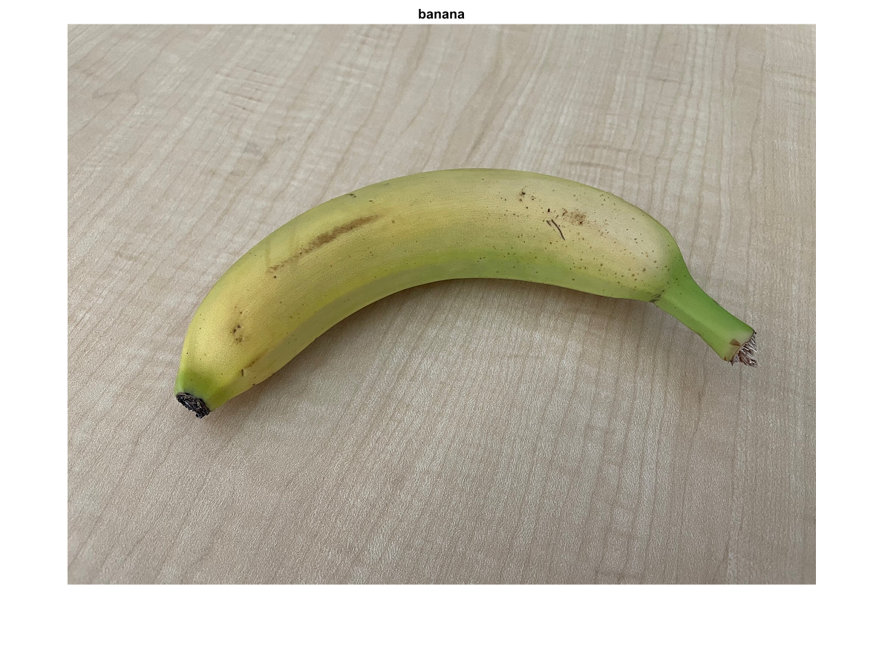

# Image Classification in MATLAB Using TensorFlow

### This example shows how to call a TensorFlow&trade; model from MATLAB&reg; using co-execution with Python&reg;.


There are different options for accessing deep learning models within MATLAB.  These include:

1. Using models created in MATLAB using the [Deep Learning Toolbox](https://www.mathworks.com/products/deep-learning.html)
2. [Converting](https://www.mathworks.com/help/deeplearning/deep-learning-import-and-export.html) models from other frameworks into MATLAB
3. Co-executing models from other frameworks with MATLAB

This example provides an overview of how to perform 3. Co-execution. For a further example on co-execution see [Hyperparameter Tuning in MATLAB using Experiment Manager & TensorFlow](https://github.com/matlab-deep-learning/Hyperparameter-Tuning-in-MATLAB-using-Experiment-Manager-and-TensorFlow).

For reference, the following [table](#comparison-table) provides a comparison for all options.

## What is co-execution?

Co-execution between MATLAB and TensorFlow is when both frameworks are used together, in executing a single application.  Co-execution can achieve this by passing data to and from each framework. It requires MATLAB and Tensorflow to be installed on the same machine.

### Requirements

The example requires the following to be installed:

* [MATLAB R2024b](https://www.mathworks.com/products/matlab.html)
* [Tensorflow 2.8](https://www.tensorflow.org/install)
* [Python 3.8+](https://www.python.org/downloads/)

For more information about installing Python, see [Install Supported Python Implementation](https://www.mathworks.com/help/matlab/matlab_external/install-supported-python-implementation.html). 

## Why perform co-execution?

There are many benefits to co-execution. These include:

* You can leverage the features and capabilities of both frameworks together in a single application.  For example, MATLAB performs the pre-and post-processing of data when training a model in TensorFlow.
* Teams working in multiple frameworks can build applications together.  This reduces the need to:
	* Rely on a single language
	* Manually re-code code from one language to another.
	* Force some team members to work in their non-preferred environment.

## What are the limitations of co-execution?

* Performance - Due to data passed between frameworks, there is a latency introduced. In most situations, the latency overhead is negligible, e.g., when performing model training. In other situations, e.g., performing inference at high throughputs, the latency impact is higher.
* Automatic code generation to embedded-devices. MATLAB can automatically generate code for the following: [C/C++ using MATLAB Coder](https://www.mathworks.com/products/matlab-coder.html), [CUDA using GPU Coder](https://www.mathworks.com/products/gpu-coder.html) and, [VHDL using Deep Learning HDL Toolbox](https://www.mathworks.com/products/deep-learning-hdl.html), including the deep learning model and pre and post-processing steps.  This deployment option is not available when co-execution with TensorFlow.  
	* Note: For versions R2022a or newer, MATLAB supports integration with TensorFlow Lite (TFLite) pretrained models. This enables the simulation of TensorFlow Lite models from both MATLAB and Simulink.  For code generation, MATLAB generates code for pre and/or post-processing and generates a call to the TensorFlow Lite interpreter on a supported target.
* Datatype conversion and data reformatting - Only select data types in both frameworks are supported for co-execution. This is because not all data types from one framework can be mapped and translated into an equivalent type in the other framework. For a list of data types that can be used, see [MATLAB to Python Data Type Mapping](https://www.mathworks.com/help/matlab/matlab_external/passing-data-to-python.html),

# How can co-execution be performed?

In this repo, 2 workflows for performing co-execution are presented.

[1.](#matlabcallingtflivetask) **MATLAB calling a TensorFlow model using a Live Editor task**

[2.](#matlabcallingtf) **MATLAB calling a TensorFlow model using MATLAB commands**

## MATLAB calling a TensorFlow model using Live Editor tasks <a name="matlabcallingtflivetask"/>

Using the MATLAB Live Editor task for Python enables users to write or copy & paste Python code into MATLAB.

Steps to use the MATLAB Live Editor task for Python are:
* Write or copy & paste Python code into the Live Editor task
* Define MATLAB input variables to be called in Python
* Define Python output variables to be called in MATLAB

Example code available here: [MATLAB calling TensorFlow model for Image Classification using a Live Editor task.mlx](https://github.com/matlab-deep-learning/Image-Classification-in-MATLAB-Using-TensorFlow/blob/main/MATLAB%20calling%20TensorFlow%20model%20for%20Image%20Classification%20using%20a%20Live%20Editor%20task.mlx)

* **Read in image**

```matlab:Code(Display)
imgOriginal = imread("./Images/banana.png");
imshow(imgOriginal)
```


Each pretrained model in tensorflow.keras.applications takes input Images of different sizes. Therefore the image being classified needs to be resized. 

```matlab:Code(Display)
imageHWSize = 480;
img = imresize(imgOriginal, [imageHWSize, imageHWSize]);
```
TensorFlow orients image data in a different format to MATLAB. This requires conversion (HWCN TO NHWC)
```matlab:Code(Display)
imgforTF = permute(img, [4 1 2 3]); 
batch_size = int32(1); % Tensorflow require inputs to be converted to int32.
```

* **Import TensorFlow model using the Live Task for Python**





## MATLAB calling a TensorFlow model using MATLAB commands <a name="matlabcallingtf"/>

Example code available here: [ImageClassificationinMATLABusingTensorFlow.m](https://github.com/matlab-deep-learning/Image-Classification-in-MATLAB-Using-TensorFlow/blob/main/ImageClassificationinMATLABusingTensorFlow.m)

* **Configuring python setup:**

The script [checkPythonSetup](https://github.com/matlab-deep-learning/Image-Classification-in-MATLAB-Using-TensorFlow/blob/main/checkPythonSetup.m) contains commands to help set up the python environment. You don't need to run these commands, unless the default Python configuration causes errors.
```matlab:Code(Display)
checkPythonSetup 
```

For more information on setting up or troubleshooting the Python Environment in MATLAB see [Calling Python from MATLAB](https://www.mathworks.com/help/matlab/call-python-libraries.html)

* **Loading an image:**
```matlab:Code(Display)
imgOriginal = imread("./Images/banana.png");
imshow(imgOriginal)
```


* **Preparing inputs:**

```matlab:Code(Display)
imageHWSize = 480;
img = imresize(imgOriginal, [imageHWSize, imageHWSize]);

% TensorFlow orients image data in a different format to MATLAB. This 
% requires conversion (HWCN TO NHWC)
imgforTF = permute(img, [4 1 2 3]); 
```

batch_size = int32(1); % Tensorflow require inputs to be converted to int32.

* **Importing model directly into MATLAB:**
```matlab:Code(Display)
model = py.tensorflow.keras.applications.efficientnet_v2.EfficientNetV2L();  
```
* **Calling a TensorFlow pretrained model for image classification:**

```matlab:Code(Display)
% converting input from MATLAB array into Python array.
X = py.numpy.asarray(imgforTF);

% call preprocessing function that is required for the image input in Keras.
X = py.tensorflow.keras.applications.efficientnet_v2.preprocess_input(X); 

% classify image 
Y = model.predict(X, batch_size); 

% label of classification output
label = py.tensorflow.keras.applications.efficientnet_v2.decode_predictions(Y); 
```
Note that many [pretrained models](https://www.mathworks.com/help/deeplearning/ug/pretrained-convolutional-neural-networks.html) are available for use directly in MATLAB without the need for co-execution. 

* **Gathering and displaying the classification result in MATLAB:**
```matlab:Code(Display)
label = label{1}{1}{2}; % The label is stored in a nested cell. In the file layer of the cell there is a tuple (id, class, probability) - The predicted class label is the 2nd element of the tuple
labelStr = string(label); 
imshow(imgOriginal);
title(labelStr,Interpreter="none");
```


## Comparison of Models accessible in MATLAB <a name="comparison-table"/>
| Capability  | Models created using the [Deep Learning Toolbox](https://www.mathworks.com/products/deep-learning.html) | Models [Converted from other Frameworks](https://www.mathworks.com/help/deeplearning/deep-learning-import-and-export.html)| Co-execution |
| ------------- | ------------- | ------------- | ------------- |
| Integrates with pre and post processing with MATLAB |  |   |     |
| Requires installation of MATLAB products only |   |  |   |
| Supports debugging from MATLAB|    |   |   |
| Offers best inference performance in MATLAB and Simulink|    |   |   |
| Comes with many MATLAB application examples  |   |  |   |
| Requires no datatype conversion and data reformatting |    |  |   |
| Provides largest coverage for embedded code generation with [MATLAB Coder](https://www.mathworks.com/products/matlab-coder.html), [GPU Coder](https://www.mathworks.com/products/gpu-coder.html) & [Deep Learning HDL Toolbox](https://www.mathworks.com/products/deep-learning-hdl.html) |    |  |   |
| Requires no additional libraries for standalone deployment with [MATLAB Compiler](https://www.mathworks.com/products/compiler.html)  |    |  |   |
| Accesses popular models in a single line of code  |    |   |   |
| Access to models from TensorFlow and PyTorch |  |  |     |


Key:

 Most support and / or low effort
 Some support and / or some effort
 Little to no support  and / or high effort

Copyright 2024, The MathWorks, Inc.
